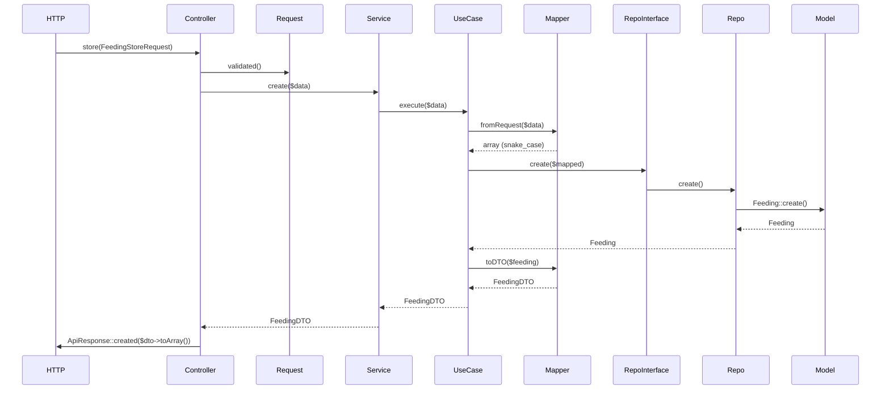

# Mapa de Arquitetura — Módulo Feeding

Documento que descreve o fluxo de dados e os arquivos envolvidos no módulo **Feeding** (arraçoamento) da API Piuba.

---

## 1. Visão geral das camadas

```
┌─────────────────────────────────────────────────────────────────────────────┐
│  APRESENTAÇÃO (Presentation)                                                 │
│  Controller, Requests, Resources                                             │
└─────────────────────────────────────────────────────────────────────────────┘
                                    │
                                    ▼
┌─────────────────────────────────────────────────────────────────────────────┐
│  APLICAÇÃO (Application)                                                      │
│  Services → UseCases, DTOs, Mappers (uso em UseCases)                         │
└─────────────────────────────────────────────────────────────────────────────┘
                                    │
                                    ▼
┌─────────────────────────────────────────────────────────────────────────────┐
│  DOMÍNIO (Domain)                                                             │
│  Interfaces de repositório, Models                                           │
└─────────────────────────────────────────────────────────────────────────────┘
                                    │
                                    ▼
┌─────────────────────────────────────────────────────────────────────────────┐
│  INFRAESTRUTURA (Infrastructure)                                             │
│  Implementação de repositórios, Mappers                                       │
└─────────────────────────────────────────────────────────────────────────────┘
```

---

## 2. Fluxo por operação (Request → Response)

### 2.1 Criar Feeding (POST /company/feeding)



**Arquivos no fluxo:**

| Camada        | Arquivo |
|---------------|--------|
| Presentation  | `FeedingController.php` → `store()` |
| Presentation  | `FeedingStoreRequest.php` (validação) |
| Application   | `FeedingService.php` → `create()` |
| Application   | `CreateFeedingUseCase.php` → `execute()` |
| Application   | `FeedingDTO.php` |
| Application   | `AlertService.php` (alerta de estoque baixo) |
| Domain        | `FeedingRepositoryInterface.php` |
| Domain        | `Feeding.php` (Model), `Batch.php`, `FeedControl.php` |
| Infrastructure| `FeedingRepository.php` → `create()` |
| Infrastructure| `FeedingMapper.php` → `fromRequest()`, `toDTO()` |

---

### 2.2 Listar Feedings (GET /company/feedings)

```
FeedingController::index()
  → FeedingService::showAllFeedings()
    → ListFeedingsUseCase::execute()
      → FeedingRepositoryInterface::paginate()
        → FeedingRepository::paginate()
          → Feeding::with('batch')->paginate()
      ← PaginationInterface (items + total, etc.)
    ← FeedingResource::collection($items)->additional(['pagination' => ...])
  ← AnonymousResourceCollection
→ ApiResponse::success($data, ..., $pagination)
```

**Arquivos:** `FeedingController`, `FeedingService`, `ListFeedingsUseCase`, `FeedingRepositoryInterface`, `FeedingRepository`, `FeedingResource`.

---

### 2.3 Mostrar um Feeding (GET /company/feeding/{id})

```
FeedingController::show($id)
  → FeedingService::showFeeding($id)
    → ShowFeedingUseCase::execute($id)
      → FeedingRepository::showFeeding('id', $id)
      → FeedingMapper::toDTO($feeding)
    ← FeedingDTO
  ← FeedingDTO
→ ApiResponse::success($dto->toArray())
```

**Arquivos:** `FeedingController`, `FeedingService`, `ShowFeedingUseCase`, `FeedingRepository`, `FeedingMapper`, `FeedingDTO`.

---

### 2.4 Atualizar Feeding (PUT /company/feeding/{id})

```
FeedingController::update($request, $id)
  → FeedingService::updateFeeding($id, $request->validated())
    → UpdateFeedingUseCase::execute($id, $data)
      → FeedingMapper::fromRequest($data)
      → FeedingRepository::update($id, $mapped)
      → FeedingMapper::toDTO($feeding)
    ← FeedingDTO
  ← FeedingDTO
→ ApiResponse::success($dto->toArray())
```

**Arquivos:** `FeedingController`, `FeedingUpdateRequest`, `FeedingService`, `UpdateFeedingUseCase`, `FeedingMapper`, `FeedingRepository`, `FeedingDTO`.

---

### 2.5 Deletar Feeding (DELETE /company/feeding/{id})

```
FeedingController::destroy($id)
  → FeedingService::deleteFeeding($id)
    → DeleteFeedingUseCase::execute($id)
      → FeedingRepository::delete($id)
  ← bool
→ ApiResponse::success() ou 404
```

**Arquivos:** `FeedingController`, `FeedingService`, `DeleteFeedingUseCase`, `FeedingRepository`.

---

## 3. Mapa de arquivos do módulo Feeding

```
app/
├── Presentation/
│   ├── Controllers/
│   │   └── FeedingController.php          # Rotas: index, show, store, update, destroy
│   ├── Requests/Feeding/
│   │   ├── FeedingStoreRequest.php        # Validação do POST
│   │   └── FeedingUpdateRequest.php       # Validação do PUT
│   └── Resources/Feeding/
│       └── FeedingResource.php            # Formato JSON da listagem
│
├── Application/
│   ├── Services/
│   │   └── FeedingService.php             # Orquestra UseCases (pass-through)
│   ├── UseCases/Feeding/
│   │   ├── CreateFeedingUseCase.php       # Regras: lote ativo, estoque, alertas
│   │   ├── ListFeedingsUseCase.php        # Paginação + FeedingResource
│   │   ├── ShowFeedingUseCase.php         # Busca por id → DTO
│   │   ├── UpdateFeedingUseCase.php       # Atualização + validações
│   │   └── DeleteFeedingUseCase.php       # Remoção
│   └── DTOs/
│       └── FeedingDTO.php                 # Objeto de transferência (camelCase)
│
├── Domain/
│   ├── Repositories/
│   │   └── FeedingRepositoryInterface.php # Contrato do repositório
│   └── Models/
│       └── Feeding.php                    # Eloquent Model (batch_id, feeding_date, etc.)
│
└── Infrastructure/
    ├── Persistence/
    │   └── FeedingRepository.php          # Implementação: create, update, delete, paginate, etc.
    └── Mappers/
        └── FeedingMapper.php              # fromRequest(), toDTO(), modelToArray()
```

---

## 4. Dependências do CreateFeedingUseCase (caso mais rico)

O **CreateFeedingUseCase** é o que mais integra com outros módulos:

| Dependência | Uso |
|-------------|-----|
| `FeedingRepositoryInterface` | Persistir o feeding |
| `BatchRepositoryInterface` | Validar lote ativo e obter company_id |
| `FeedControlRepositoryInterface` | Estoque de ração e totais (current_stock, daily_consumption) |
| `StockRepositoryInterface` | Atualizar estoque geral (current_quantity, withdrawal_quantity) |
| `AlertService` | Criar alerta de estoque baixo |
| `FeedingMapper` | Request → array; Model → DTO |

Métodos do **FeedingRepository** usados nesse fluxo:

- `create(array $data): Feeding`
- `getDailyConsumptionAverage(string $companyId, string $feedType, int $days): float`

Outros métodos do repositório (usados em outros contextos, ex.: relatórios, regras):

- `getTotalConsumptionLastDays()`
- `getTotalFeedConsumedByBatchUntilDate()`
- `hasFeedingsForBatch()`

---

## 5. Resumo

| Camada | Responsabilidade |
|--------|------------------|
| **Presentation** | HTTP, validação de request, formatação da resposta (Resource/ApiResponse). |
| **Application** | Orquestração (Service), regras de negócio (UseCases), DTOs. |
| **Domain** | Contratos (interfaces) e entidades (Models). |
| **Infrastructure** | Implementação de repositório (FeedingRepository), mapeamento (FeedingMapper). |

O **FeedingRepository** (`app/Infrastructure/Persistence/FeedingRepository.php`) implementa `FeedingRepositoryInterface` e é a única classe que acessa o model `Feeding` para persistência e consultas; os UseCases dependem apenas da interface (Dependency Inversion).
