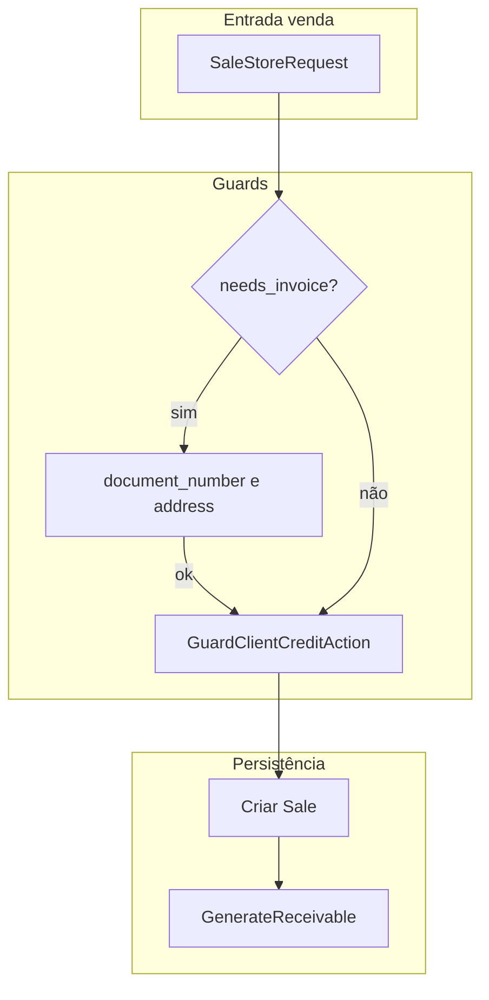

# Módulo Cliente — Documentação e regras de negócio

Este documento descreve o módulo de **clientes** (`clients`) da API Piuba: responsabilidades por camada, rotas, permissões e **regras de negócio** implementadas no código.

---

## 1. Visão geral

O cliente pertence a uma **empresa** (`company_id`). No modelo SaaS multi-tenant, o mesmo CPF/CNPJ pode existir em **empresas diferentes**; a unicidade do documento é **por empresa**, não global.

Fluxo típico:

- **HTTP** → `FormRequest` (validação) → **UseCase** (orquestração / transação) → **Repository** (persistência) → model `Client`.
- Resposta da API: `ClientDTO` serializado via `toArray()` (camelCase), exceto na listagem paginada que usa `ClientResource`.

---

## 2. Arquivos principais (referência rápida)

| Camada | Arquivo |
|--------|---------|
| Model | `app/Domain/Models/Client.php` |
| Enum | `app/Domain/Enums/PriceGroup.php` |
| Repositório (interface) | `app/Domain/Repositories/ClientRepositoryInterface.php` |
| Repositório (impl.) | `app/Infrastructure/Persistence/ClientRepository.php` |
| DTO entrada | `app/Application/DTOs/ClientInputDTO.php` |
| DTO saída | `app/Application/DTOs/ClientDTO.php` |
| Regra validação documento | `app/Rules/DocumentNumberRule.php` |
| Requests | `app/Presentation/Requests/Client/ClientStoreRequest.php`, `ClientUpdateRequest.php` |
| Controller | `app/Presentation/Controllers/ClientController.php` |
| Resource (lista) | `app/Presentation/Resources/Client/ClientResource.php` |
| Rotas | `routes/app/company/client.php` |
| Crédito (venda) | `app/Application/Actions/Client/GuardClientCreditAction.php` |
| Comando inadimplência | `app/Console/Commands/MarkOverdueClientsCommand.php` |

---

## 3. Regras de negócio

### 3.1 Documento (CPF / CNPJ)

| Regra | Implementação |
|-------|----------------|
| **Tipo de pessoa** | `person_type` obrigatório: `individual` ou `company`. |
| **CPF** | Se `individual`, `document_number` (quando informado) deve ter **exatamente 11 dígitos** numéricos. Caracteres não numéricos são removidos antes da contagem. |
| **CNPJ** | Se `company`, `document_number` (quando informado) deve ter **exatamente 14 dígitos** numéricos. |
| **Opcional no cadastro** | `document_number` pode ser `null`/vazio no banco e na API (nullable). |
| **Validação** | `DocumentNumberRule` + regras nos `ClientStoreRequest` / `ClientUpdateRequest`. |

**Observação:** Não há validação de dígitos verificadores de CPF/CNPJ; apenas formato (quantidade de dígitos) alinhado ao tipo de pessoa.

---

### 3.2 Unicidade do documento (escopo empresa)

| Regra | Implementação |
|-------|----------------|
| **Negócio** | Um mesmo CPF/CNPJ não pode se repetir **dentro da mesma** `company_id`. |
| **API** | `Rule::unique('clients')->where('company_id', ...)`, com `ignore` no update para o próprio registro. |
| **Banco** | Índice único composto `UNIQUE(company_id, document_number)` (migration `2026_03_24_100000_add_uniqueness_credit_market_to_clients_table.php`). |
| **Atualização** | Se a validação for contornada (ex.: concorrência), o `UPDATE` pode violar o índice; `UpdateClientUseCase` captura `QueryException` SQLSTATE `23000` com mensagem contendo `clients_company_document_unique` e relança `ClientDocumentAlreadyExistsException` (HTTP 422). |

**Observação (SQL):** Em geral, várias linhas com `document_number = NULL` podem coexistir na mesma empresa, pois `NULL` não entra em igualdade em unicidade. O comportamento exato depende do SGBD.

---

### 3.3 Venda com nota fiscal (`needs_invoice`)

| Regra | Implementação |
|-------|----------------|
| **Quando** | Na criação de venda (despesca), se `needs_invoice` for `true` no payload validado. |
| **Obrigatoriedade** | O cliente deve ter **`document_number` e `address` preenchidos** (não vazios). |
| **Onde** | `ProcessHarvestSaleUseCase::guardClientFiscalData()` (fluxos com e sem estocagem). |
| **Falha** | `ClientMissingFiscalDataException` → tratada no `Handler` como erro de domínio (HTTP 422). |

Campos continuam **nullable** no cadastro de cliente; a exigência é **condicional** ao fluxo de venda com NF.

---

### 3.4 Exclusão (soft delete) e integridade financeira

| Regra | Implementação |
|-------|----------------|
| **Soft delete** | Model `Client` usa `SoftDeletes` (`deleted_at`). |
| **Bloqueio de exclusão** | Não é permitido excluir (soft delete) o cliente se existir **conta a receber** vinculada a **vendas** desse cliente com status **`pending` ou `overdue`**. |
| **Vínculo** | `sales.client_id` → `financial_transactions` com `reference_type = sale` e `reference_id = sale.id`. |
| **Onde** | `DeleteClientUseCase` chama `ClientRepository::hasPendingObligations()` antes de `delete()`. |
| **Falha** | `ClientHasPendingObligationsException` (HTTP 422). |
| **Não encontrado** | Se o cliente não existir, `ModelNotFoundException` (HTTP 404). |

**Importante:** A regra olha para **transações financeiras** ligadas a vendas com status pendente/atrasado, não apenas “existência de vendas” sem filtro de status.

---

### 3.5 Anonimização (LGPD) e exclusão

| Regra | Implementação |
|-------|----------------|
| **Objetivo** | Atender pedido de eliminação de dados sensíveis mantendo **id** e **nome** para histórico (vendas, relatórios). |
| **Campos limpos/mascarados** | `email`, `phone`, `address`, `contact` → `null`; `document_number` → literal `[ANONIMIZADO]`. |
| **Depois** | `AnonymizeClientUseCase` chama `anonymize()` e em seguida **soft delete** (`delete()`). |
| **Rota** | `DELETE /company/client/{id}/anonymize` (mesma permissão `delete-client` que o destroy). |
| **Não encontrado** | `ModelNotFoundException` se o cliente não existir. |

**Observação:** O valor `[ANONIMIZADO]` no documento pode conflitar com a unicidade `(company_id, document_number)` se vários clientes forem anonimizados na mesma empresa. Avaliar estratégia futura (ex.: sufixo único por id) se isso ocorrer na prática.

---

### 3.6 Limite de crédito

| Regra | Implementação |
|-------|----------------|
| **Campo** | `credit_limit` decimal nullable na tabela `clients`. |
| **Sem limite** | Se `credit_limit` for `null`, **não** há bloqueio por crédito na venda. |
| **Com limite** | Antes de criar a venda (despesca), soma-se o **valor em aberto** do cliente (transações `pending` + `overdue` ligadas a vendas) + **valor da nova venda** (`total_weight × price_per_kg`). Se ultrapassar o limite, a operação falha. |
| **Onde** | `GuardClientCreditAction`, invocado por `ProcessHarvestSaleUseCase`. |
| **Falha** | `ClientCreditLimitExceededException` (HTTP 422). |

---

### 3.7 Inadimplência (`is_defaulter`)

| Regra | Implementação |
|-------|----------------|
| **Campo** | `is_defaulter` boolean (default `false`) em `clients`. |
| **Marcação** | Cliente é considerado inadimplente se possuir **pelo menos uma** `financial_transaction` com `status = overdue`, `reference_type = sale`, vinculada a uma venda do cliente. |
| **Desmarcação** | Clientes que estavam com `is_defaulter = true` e **não** possuem mais nenhuma transação nessa condição têm a flag removida. |
| **Comando** | `php artisan clients:mark-overdue` (opção `--dry-run` para simulação). |
| **Prazo “X dias”** | O plano original mencionava “overdue há mais de X dias”. A implementação atual **não** filtra por `due_date`; qualquer transação `overdue` já contribui para a flag. Para exigir atraso mínimo em dias, seria necessário estender o comando/consulta. |

---

### 3.8 Grupo de preço (segmentação de mercado)

| Regra | Implementação |
|-------|----------------|
| **Campo** | `price_group` enum nullable: `wholesale`, `retail`, `consumer`. |
| **Uso atual** | Armazenado e exposto na API; **não** altera automaticamente o preço na venda (evolução futura: tabela de preços por grupo). |
| **Domínio** | `App\Domain\Enums\PriceGroup`. |

---

## 4. Rotas e permissões

Prefixo efetivo conforme agrupamento em `routes/api.php` (tipicamente `/api/company/...`).

| Método | Rota (relativa ao prefixo company) | Permissão |
|--------|-------------------------------------|-----------|
| POST | `client` | `create-client` |
| GET | `clients` | `view-client` |
| GET | `client/{id}` | `view-client` |
| PUT | `client/{id}` | `update-client` |
| DELETE | `client/{id}` | `delete-client` |
| DELETE | `client/{id}/anonymize` | `delete-client` |

---

## 5. Exceções de domínio relacionadas

| Exceção | Contexto típico |
|---------|------------------|
| `ClientHasPendingObligationsException` | Exclusão com recebíveis pendentes/atrasados. |
| `ClientMissingFiscalDataException` | Venda com `needs_invoice` sem documento/endereço no cliente. |
| `ClientCreditLimitExceededException` | Nova venda ultrapassa `credit_limit`. |
| `ClientDocumentAlreadyExistsException` | Violação do índice único `(company_id, document_number)` no **update** (ex.: corrida entre requisições). |

Tratamento HTTP centralizado em `app/Presentation/Exceptions/Handler.php` para as exceções registradas.

---

## 6. Validação HTTP (resumo)

- **Create:** `company_id`, `name`, `person_type` obrigatórios; demais opcionais conforme `ClientStoreRequest`.
- **Update:** campos parciais (`sometimes` / `nullable` conforme `ClientUpdateRequest`); unicidade de documento considera `company_id` e ignora o cliente atual.
- **Normalização:** `ClientStoreRequest` faz `prepareForValidation` para aceitar aliases camelCase (`companyId`, `personType`, `documentNumber`, `creditLimit`, `priceGroup`).

---

## 7. Diagrama simplificado — venda e cliente

---

## 8. Manutenção e evolução sugerida

1. **Inadimplência por dias:** acrescentar filtro `due_date < now() - interval X day` no comando `clients:mark-overdue` e documentar o parâmetro (config ou option).
2. **Anonimização e unique:** se múltiplos anonimizados na mesma empresa forem necessários, evitar colisão em `document_number`.
3. **Alinhamento com Purchase:** Purchase devolve model + `Resource`; Cliente devolve `ClientDTO` + `toArray()` — unificar padrão se desejar consistência total entre módulos.
4. **OpenAPI:** atualizar anotações do `ClientController` se o contrato da API mudar.

---

*Última atualização: documento gerado para refletir o estado do repositório no momento da escrita; conferir os arquivos citados após refatorações.*
